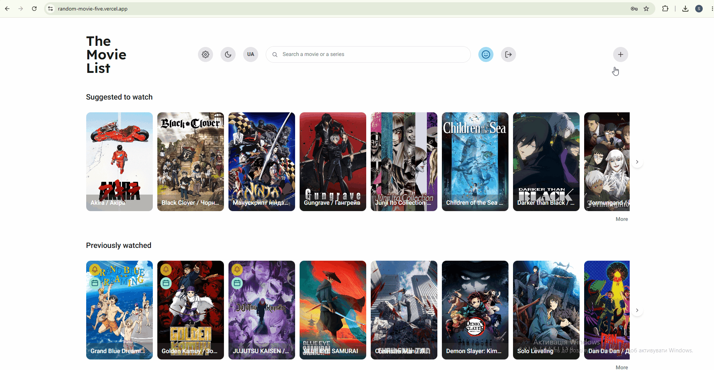

# 🎬 The Movie List

A personal movie & TV show watchlist app — track what you want to watch, what you've already watched, and let the app pick something for you when you can't decide.

**🔗 Live demo:** [random-movie-five.vercel.app](https://random-movie-five.vercel.app)
**🔗 Backend repo:** [random.movie.back](https://github.com/shelyakova/random.movie.back)

> Built as a portfolio project to demonstrate a full, production-style feature set — auth, a real third-party API integration, accessibility, responsive/TV design, and localization — on top of a modern React/Next.js stack.



---

## ✨ Features

- **Personal watchlist** — add, edit, and delete films, mark them as watched/unwatched
- **TMDB integration** — search movies & TV shows by title, auto-fill the whole form (poster, description, year, duration, seasons/episodes, ratings) from The Movie Database, and refresh a film's data from TMDB at any time
- **Categories** — create custom categories and filter your list by them
- **Randomizer** — can't decide what to watch? Get a random unwatched film that respects your current search/category/date filters
- **Poster management** — upload your own poster, pull one automatically from TMDB, or remove it — old posters are cleaned up from storage automatically
- **Smart filtering & search** — filter by category, "new season out", "latest episode available", or free-text search, all reflected in the URL
- **Infinite scroll & pagination** — sliders on the home page, full-page grids when you want to see everything
- **Light / dark theme** — manual toggle, persisted across visits, no flash of the wrong theme on load
- **Localization** — English and Ukrainian, including correct Ukrainian plural forms (sezons, episodes, etc.)
- **Responsive design** — tuned for mobile, desktop, and Smart TV browsers (including remote/keyboard-only navigation)
- **Accessibility** — labeled form fields, keyboard-navigable modals with focus trapping, visible focus indicators, and WCAG-checked color contrast

---

## 🛠 Tech stack

| Category            | Tools                                                              |
| -------------------- | ------------------------------------------------------------------- |
| Framework            | Next.js (App Router), TypeScript                                  |
| Styling              | Tailwind CSS, centralized design tokens, light/dark theming       |
| State & data fetching| TanStack Query, Zustand                                           |
| Forms & validation   | React Hook Form, Zod                                               |
| Localization         | next-intl (English / Ukrainian)                                    |
| Testing              | Playwright (end-to-end), Vitest (unit)                             |
| Auth                 | JWT-based, custom implementation                                   |
| Media                | Cloudinary (poster storage & delivery)                             |
| External API         | The Movie Database (TMDB) via a backend proxy                      |
| Deployment           | Vercel (frontend), Render (backend), Neon (Postgres)               |

---

## 🚀 Getting started

### Prerequisites

- Node.js 20+
- A running instance of the [backend](https://github.com/shelyakova/random.movie.back) (or point `NEXT_PUBLIC_API_URL` at the deployed one)

### Installation

```bash
git clone https://github.com/shelyakova/random.movie.git
cd random.movie
npm install
```

### Environment variables

Create a `.env.local` file in the project root:

```dotenv
NEXT_PUBLIC_API_URL=https://your-backend-url.example.com
```

### Run the dev server

```bash
npm run dev
```

The app will be available at [http://localhost:3000](http://localhost:3000).

### Run tests

```bash
# Unit tests
npm test

# End-to-end tests (requires the app running via `npm run dev:test`
# against a dedicated test backend/database — see tests/ for setup)
npx playwright test
```

---

## 📁 Project structure (high level)

```
app/            Next.js App Router pages & layouts
components/     Reusable UI components
hooks/          Custom hooks (data fetching, forms, business logic)
lib/            API clients, Zod schemas, types, constants
messages/       i18n translation files (en.json, uk.json)
tests/          Playwright end-to-end tests
```

---

## 🔗 Related

This is the frontend of a two-repo project. The backend (NestJS, Prisma, PostgreSQL) lives at [random.movie.back](https://github.com/shelyakova/random.movie.back).

---

## 👩‍💻 Author

Built by [Sofiia Sheliakova](https://github.com/shelyakova) as a portfolio project — feedback and questions welcome.
